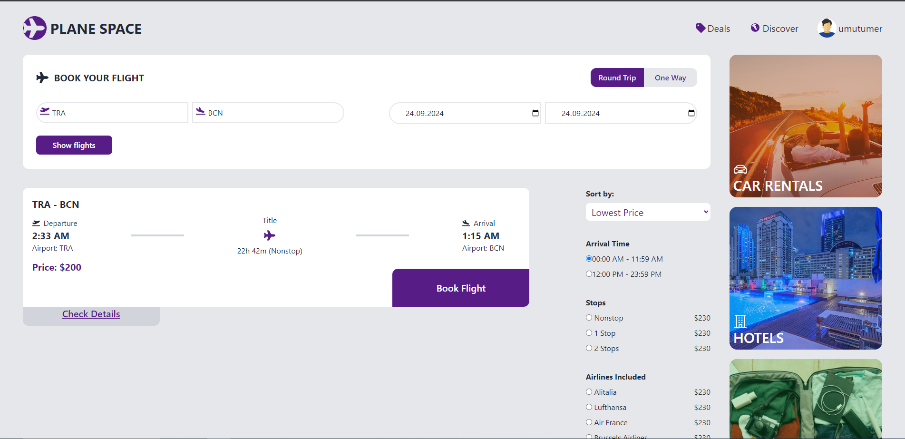
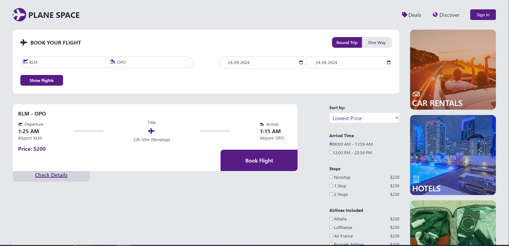
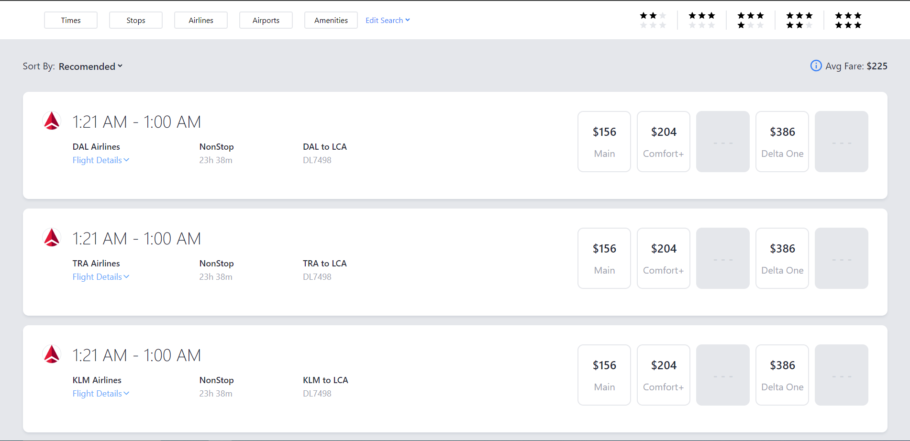
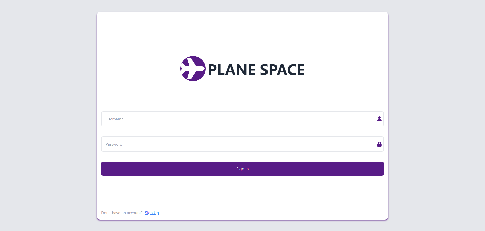
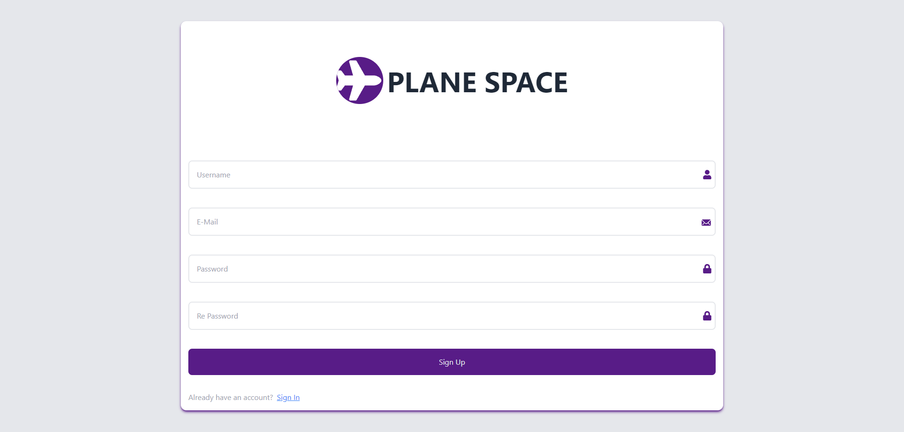

# Plane Space App

Bu projede kullanıcı, kayıt olup giriş yaptıktan sonra ekranda gördüğü uçuşları filtreleyip istediği uçuşu seçebilir ve "Uçuşlarım" sayfasına ekleyebilir. Proje backend olarak Node.js ve MongoDB, frontend olarak React ve Tailwind CSS kullanılarak geliştirilmiştir.

## Projeyi Başlatma

### Backend Başlatma

1. Terminal üzerinden `server` dizinine gidin.
2. `npm install` komutunu çalıştırarak gerekli bağımlılıkları indirin.
3. `npm start` komutunu çalıştırarak backend'i başlatın.

### Frontend Başlatma

1. Proje ana dizininde terminali açın.
2. `npm install` komutunu çalıştırarak gerekli bağımlılıkları indirin.
3. Kendi mongo db bağlantınızı ekleyin.
4. `npm start` komutunu çalıştırarak frontend'i başlatın.

## Ekran Görüntüleri

